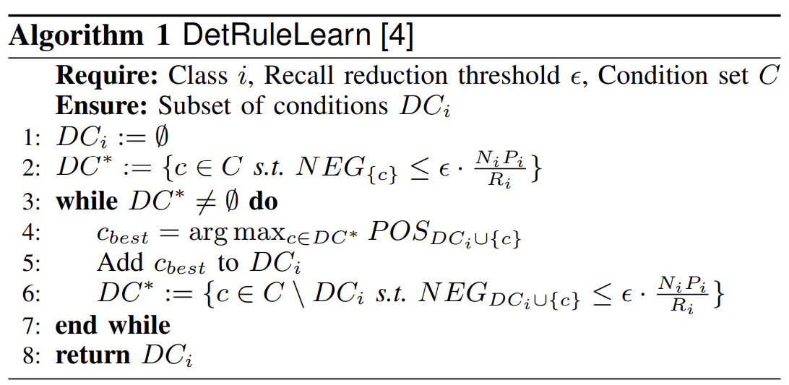
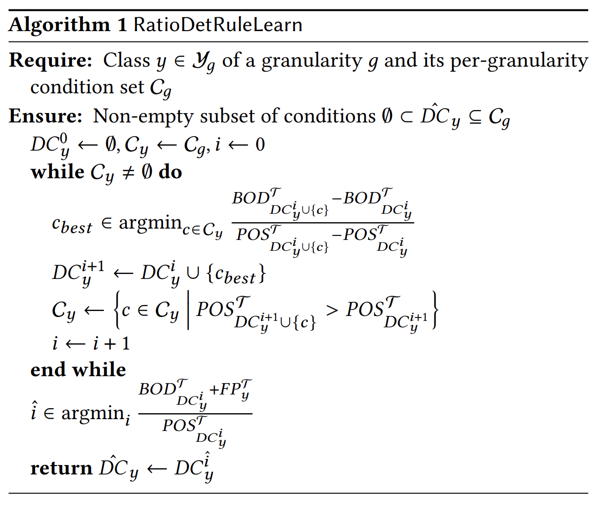

# EDCR

## Important limitations
At the moment, I only wrote the code to account for a binary classification case. In other words, there's only two classes. I don't believe it would be that hard to implement it in a multiclass setting though. You would basically just need to repeat the same thing n times (where n is the number of classes.)

## How to use EDCR
EDCR takes in a list of predicates and returns a subset of these predicates. At the moment, I set it up in a way where predicates can be any function that takes in two parameters, the metadata and the model's prediction and then returns True or False.

### Detection:
When it comes to the use of Detection Rules, the following is mentioned in the [EDCR paper](https://arxiv.org/pdf/2308.14250).
> The intuition is first to create error detecting rules for each class, which effectively re-assigns any sample into an “unknown” class. 

### Correction:
When it comes to the use of Correction Rules, the following is mentioned in the [EDCR paper](https://arxiv.org/pdf/2308.14250).


### Step 1
In this repo, we call predicates conditions. You define a condition like this:
```python
Condition([The name of the condition], [A function which returns true or false])
```
For example:
```python
Condition("X is equal to 1", lambda x: x["x"] == 1)
```


### Step 2
After creating a list of conditions:
```python
conditions = [
    Condition(..., ...),
    Condition(..., ...),
    Condition(..., ...),
    Condition(..., ...),
    ...
]
```
You can pass it into the Error Detector:

```python
detector = EdcrRatioDetRuleLearnErrorDetector()
detector.train(
    data=[A list of dicts representing the data], 
    pred=[A list of predictions], 
    labels=[A list of labels], 
    conditions=conditions
)
```

Example:
```python

conditions = [
    Condition("A is equal 1", lambda x: x["a"] == 1),
    Condition("A is equal 5", lambda x: x["a"] == 5),
    Condition("C is equal to 28", lambda x: x["c"] == 28),
]

detector = EdcrDetRuleLearnErrorDetector(target_class=1)
detector.train(
    data=[
        {"a": 1, "b": 2, "c": 3},
        {"a": 5, "b": 3, "c": 5},
        {"a": 6, "b": 2, "c": 7}
    ], 
    pred=[0, 1, 0], 
    labels=[1, 0, 1], 
    conditions=conditions
)
```

pred and labels should consist of only 0s and 1s. labels represent the ground truth (the true label). pred represents the model's prediction. data is also expected to be a list of dicts.  

### Step 3  
Once the model is trained and has learned the predicates. You can now apply the predicates like so:
```python
error_detections = detector.detect(
        data=[Data],
        pred=[A model's predictions]
    )
```
Example:
```python
error_detections = detector.detect(
        data=[
            {"a": 1, "b": 2, "c": 3},
            {"a": 5, "b": 3, "c": 5},
            {"a": 6, "b": 2, "c": 7}
        ], 
        pred=[0, 1, 0], 
    )
```

### Step 4
If you're curious about the rules that were learned by EDCR, you can check the rules like so:
```python
for rule in detector.rules:
    print(rule)
```
If you passed in proper names for your conditions, you should be able to see what conditions were selected. 

## Algorithms
### Algorithm 1: DetRuleLearn:
Given a target class i, a recall reduction threshold value epsilon and a set of conditions C. A subset of conditions in C named DC_i is returned  
  
Source: https://arxiv.org/abs/2308.14250

### Algorithm 2: RatioDetRuleLearn:
  
Source: https://arxiv.org/abs/2407.15192